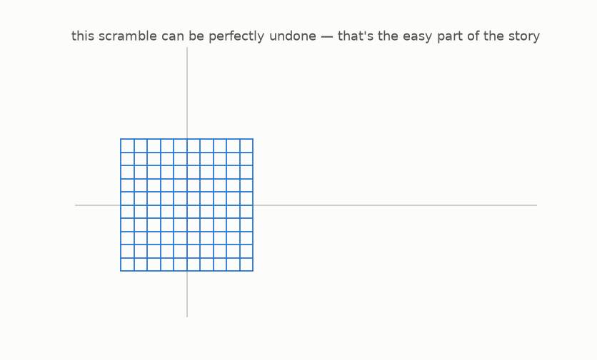
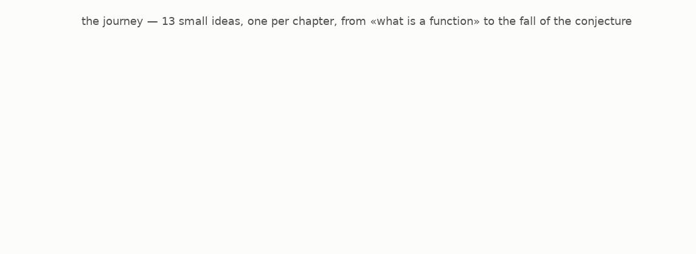

# Start here

Look at that scramble.

It looks like someone grabbed the flat grid of graph paper and smeared it across the page. And yet: **this scramble can be perfectly undone.** There is a second, equally simple recipe that takes every bent point and walks it exactly back home. No smudging, no information lost.

In 1939, a mathematician named Ott-Heinrich Keller asked an innocent question about scrambles like this one. His question became one of the most famous unsolved problems in mathematics. Generations of mathematicians attacked it. Many published proofs. **Every single proof turned out to be wrong.**

The problem stood for 87 years, and then, in July 2026, days before this guide was written, it fell. Partly. In a way nobody expected. (The most stubborn piece of it is *still* open.)

This guide takes you from **zero**, no formulas, no algebra memories needed, to genuinely understanding what Keller asked, why it is hard, and what just happened. You will not watch from a distance: at the end you can check the decisive discovery **with your own hands**, by plain arithmetic.

## What you need

- Nothing. Every idea is built from pictures first, words second, symbols last.
- Each chapter is one small idea, readable in about 5 minutes.
- Optional: Python, if you want to re-create and play with every picture in this guide. Each chapter tells you how.

## The journey

Chapters 1–8 build the ideas. Chapter 9 assembles the famous question. Chapters 10–12 tell you what humanity knows, including the July 2026 twist.

## How to read

Read in order. Look at each picture before reading the text around it. If a sentence feels obvious, good, that is the design, not an accident.

---

[Begin: chapter 1, functions are machines →](../01-functions-are-machines/README.md)
