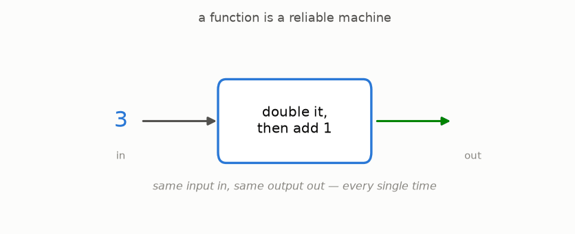
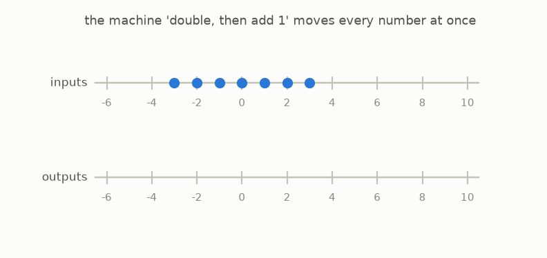

# 1 · Functions are machines

*By the end of this page you will know what mathematicians mean by a "function" — and it is nothing scary.*

## A machine for numbers



A **function** is a machine. You feed it a number. It gives you back a number. That's all.

This one's recipe is: *double it, then add 1.* Feed it 3, get 7. Feed it 0, get 1. Feed it 10, get 21.

Two rules make a machine a *function*:

1. It always gives an answer.
2. The same input always gives the same output. No moods, no randomness, no "it depends".

## Watch it move every number at once

Here is the trick that powers this whole guide. Instead of feeding the machine one number at a time, imagine it grabbing **every number on the number line at once** and carrying each one to its output:



Same machine, new point of view: a function *moves the whole line*. Keep this "everything moves at once" picture — we will use it on bigger and bigger stages.

## The nametag

Writing "the double-it-then-add-1 machine" gets old, so mathematicians give machines nametags like $f$ and write the recipe as

```math
f(x) = 2x + 1
```

Read it out loud as: "$f$ eats a number $x$ and returns $2x + 1$." The letter $x$ is just a hole where the input goes. That is all the notation this guide will ever spring on you.

## Try it

```bash
python src/viz/ch01_functions.py
```

Open the script and change `2 * x + 1` to any recipe you like — then watch how *your* machine moves the line.

---

> **The one thing to remember:** a function is a machine that turns each input into exactly one output — and you can picture it moving every number at once.

[← Start here](../00-start-here/README.md) · [Next: the undo machine →](../02-the-undo-machine/README.md)
