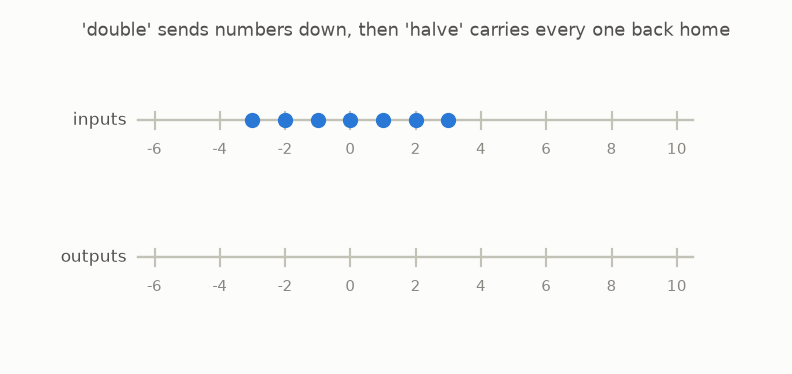
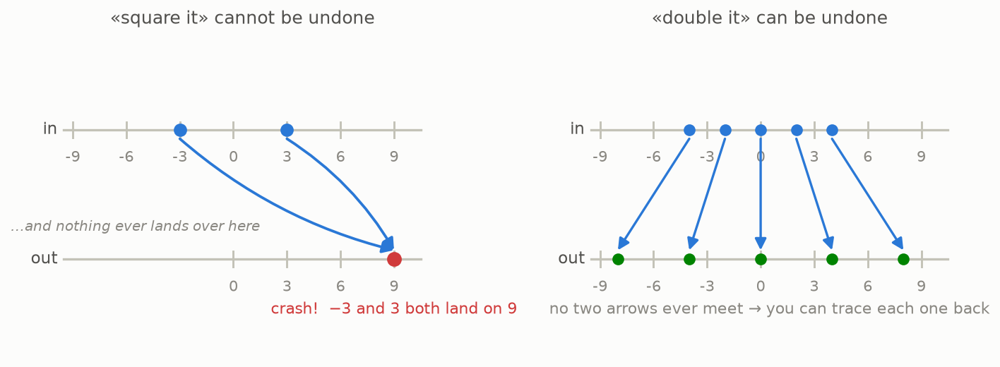

# 2 · The undo machine

*By the end of this page you will know exactly when a machine can be undone — and the two ways undoing can fail. This tiny idea is the seed of the whole story.*

## Running the film backwards

The machine *«double it»* sends 3 to 6. The machine *«halve it»* sends 6 right back to 3. Chain them and everybody ends up exactly where they started:



When a second machine walks every output back to its original input, we call it the **inverse** — the *undo machine*. Doubling and halving are inverses of each other. So are "add 5" and "subtract 5".

## When undoing is impossible

Now try to undo *«square it»* (multiply the number by itself):



Feed it −3: you get 9. Feed it 3: you also get 9. Now stand at 9 and try to walk back. **Which input did you come from?** You cannot know. The information "was it negative?" has been destroyed.

An undo machine cannot exist when:

1. **Collisions** — two different inputs land on the same output. (−3 and 3 both land on 9.)
2. **Gaps** — some outputs are never reached, so the undo machine wouldn't know what to say there. (Squaring never outputs −4.)

No collisions and no gaps: then, and only then, every output has exactly one origin, and "walk back where you came from" is a well-defined machine.

## Say it like a mathematician (optional)

*No collisions* is called **injective**. *No gaps* is called **surjective**. Both at once: **bijective**, or simply *invertible*. You can forget these words — "no collisions, no gaps" is all you need.

## Try it

```bash
python src/viz/ch02_inverse.py
```

---

> **The one thing to remember:** a machine can be undone exactly when no two inputs share an output and no output is left unreachable. Undoing fails the moment information is destroyed.

[← Functions are machines](../01-functions-are-machines/README.md) · [Next: polynomials →](../03-polynomials/README.md)
