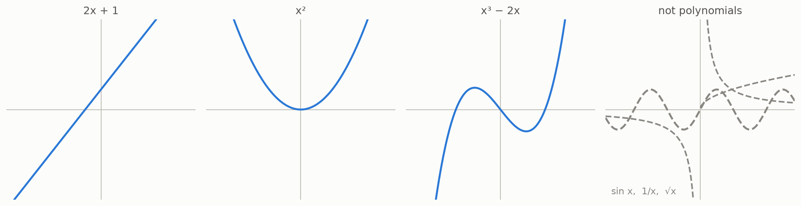

# 3 · Polynomials

*By the end of this page you will know which machines this whole story is about — the ones built from nothing but plus and times.*

## The simplest possible machines

Take an input $x$. Allow yourself only two moves:

- **add** (numbers or pieces you already built),
- **multiply** (numbers or pieces you already built).

Whatever machine you can build this way is called a **polynomial**.

- $2x + 1$ — double, add one. Polynomial.
- $x^2$ — $x$ times $x$. Polynomial. (A power is just repeated multiplication.)
- $x^3 - 2x$ — build $x \cdot x \cdot x$, build $2x$, subtract. Polynomial. (Subtracting is adding a negative.)

Here is a family portrait, drawn as graphs — for each input $x$ along the floor, the curve's height shows the output:



The dashed gray machines — $\sin x$, $1/x$, $\sqrt{x}$ — are **not** polynomials. Each needs a forbidden move: dividing by the input, or an infinite process. They are fine machines; they are just not in our club.

## Why the club matters

Polynomials are the machines you can run **exactly, with pencil and paper, in finitely many steps**. No approximations, no "undefined at zero", no infinite sums. They are the most concrete, most finite, most *checkable* machines in mathematics.

That is exactly why the puzzle in this guide is so embarrassing for mathematics: it is a question about the *tamest machines we have*, and it defeated everyone for 87 years.

The **degree** of a polynomial is its biggest power: $x^3 - 2x$ has degree 3. Keep this word in your pocket; it becomes important in chapter 10.

## Try it

```bash
python src/viz/ch03_polynomials.py
```

---

> **The one thing to remember:** a polynomial is any machine you can build using only plus and times. They are the most finite, checkable machines there are.

[← The undo machine](../02-the-undo-machine/README.md) · [Next: maps of the plane →](../04-maps-of-the-plane/README.md)
