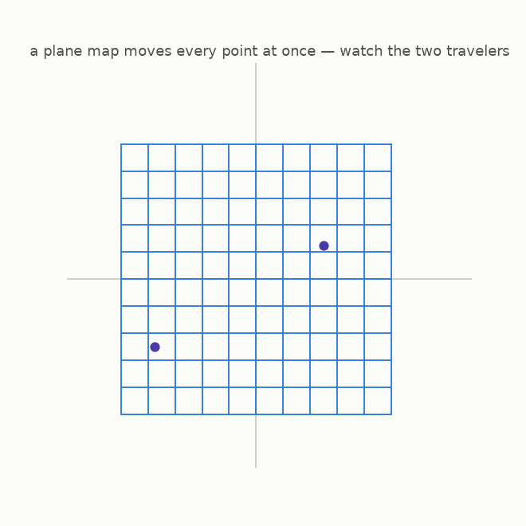
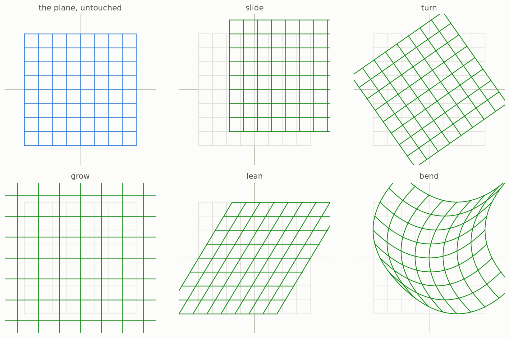

# 4 · Maps of the plane

*By the end of this page your machines will eat **points** instead of numbers — and you will see a map move an entire plane at once.*

## From the line to the plane

A **point** of the plane is a pair of numbers $(x, y)$: how far right, how far up. A **plane map** is a machine that eats a point and returns a point. Since a point is two numbers, the machine has two output slots, and each slot may use *both* inputs:

```math
F(x, y) = (\; \text{first slot: some recipe in } x, y\; ,\;\; \text{second slot: some recipe in } x, y\;)
```

## Every point moves at once

In chapter 1 a machine moved the whole number line. A plane map moves the **whole plane**. To see it, we paint a grid on the plane and watch the map carry it:



The plane behaves like a rubber sheet. The two dots are travelers: each one is picked up at $(x, y)$ and set down at $F(x, y)$.

## A small zoo of maps



Slide, turn, grow, lean — these keep the gridlines straight. The last one, *bend*, does not: its recipe uses $y^2$ and $x^2$, and squaring is what bends lines. Which brings us to the club from chapter 3:

> A **polynomial map** of the plane is one where *both* output slots are polynomials — built from $x$ and $y$ with only plus and times.
>
> Example: $F(x, y) = (x + \tfrac{1}{4}y^2,\; y + \tfrac{1}{4}x^2)$ — the *bend* panel above.

The whole rest of this guide lives inside this zoo: polynomial maps of flat space.

## Try it

```bash
python src/viz/ch04_plane_maps.py
```

Change the recipes in `PANELS` and re-run — invent your own warp.

---

> **The one thing to remember:** a plane map moves every point of the plane at once, like deforming a rubber sheet; it is a *polynomial* map when both coordinate recipes use only plus and times.

[← Polynomials](../03-polynomials/README.md) · [Next: straight maps and the area factor →](../05-straight-maps-and-area/README.md)
