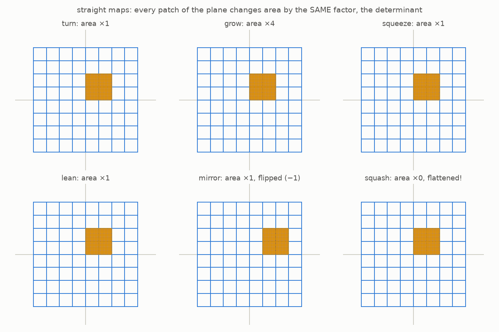
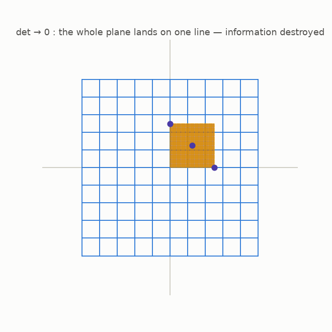

# 5 · Straight maps and the area factor

*By the end of this page you will own the single most useful number in this story: the **determinant**, how much a map scales area.*

## The disciplined maps

Some plane maps are perfectly disciplined: gridlines stay **straight**, stay **parallel**, stay **evenly spaced**, and the center point never moves. These are called **linear maps** (we'll say *straight maps*). Slide aside, they are the turns, grows, squeezes and leans of the last chapter.

Watch what each one does to the yellow patch of paint, one grid cell of area 1:



A remarkable pattern hides here. A straight map scales the yellow patch's area by some factor, and it scales **every** patch of the plane, anywhere, by that **same** factor:

- *turn*: area × 1 *squeeze*: area × 1 *lean*: area × 1
- *grow* (everything doubled): area × 4
- *mirror*: area × 1, but the patch comes out **flipped**, like a page turned over
- *squash*: area × 0, the entire plane lands on a single line

That one number, the area-scaling factor, is the map's **determinant**. For the mirror we bookkeep the flip with a minus sign: determinant −1. So the determinant tells you two things at once: *how much area stretches*, and *whether the plane got turned over*.

## Determinant zero is a catastrophe



Watch the three dots. When the determinant hits 0, the plane is crushed flat onto a line. Different points crash into the same spot, **collisions**, everywhere. Chapter 2 told you what that means: information destroyed, undo impossible.

And if the determinant is *not* zero? Then a straight map causes no collisions and leaves no gaps, and it has an undo map (also straight). For straight maps, one number decides everything:

> **Straight map undoable ⟺ determinant ≠ 0.**

## Where the number comes from (optional)

<details>
<summary>The two-by-two formula, if you want it</summary>

A straight map is fully described by four numbers: $F(x, y) = (a x + b y,\; c x + d y)$. Its determinant is $ad - bc$. You never need to compute one by hand in this guide, the computer will, but it is nice to know the magic number is just arithmetic on the recipe.

</details>

## Try it

```bash
python src/viz/ch05_linear_determinant.py
```

---

> **The one thing to remember:** every straight map scales all areas by one fixed factor, the determinant. Nonzero factor: undoable. Factor zero: the plane is crushed and information dies.

[← Maps of the plane](../04-maps-of-the-plane/README.md) · [Next: bending the grid →](../06-bending-the-grid/README.md)
