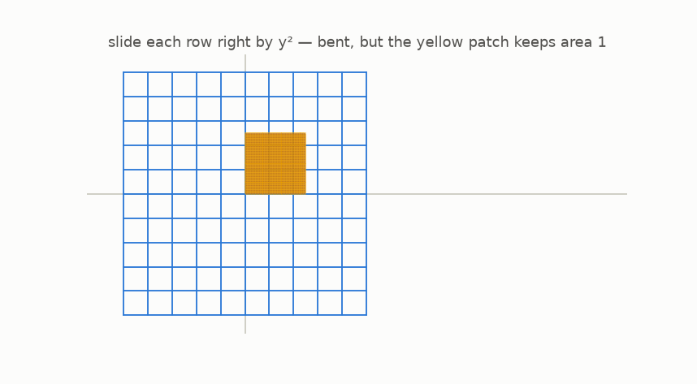
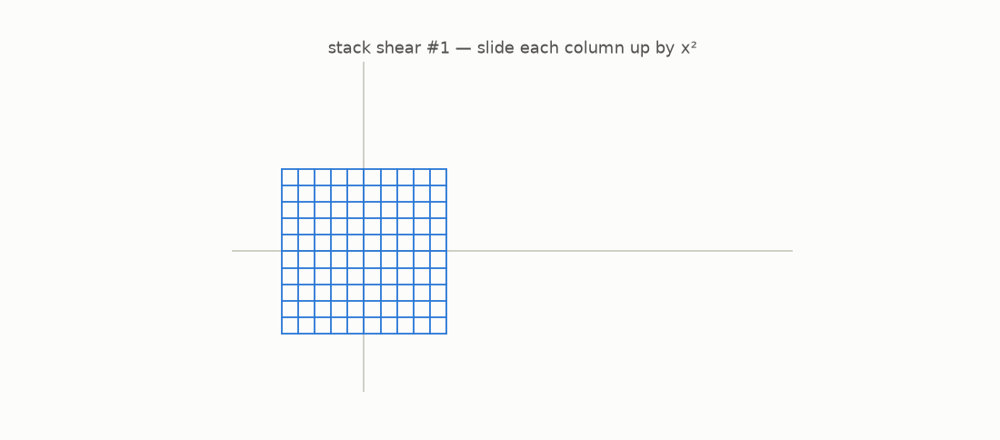
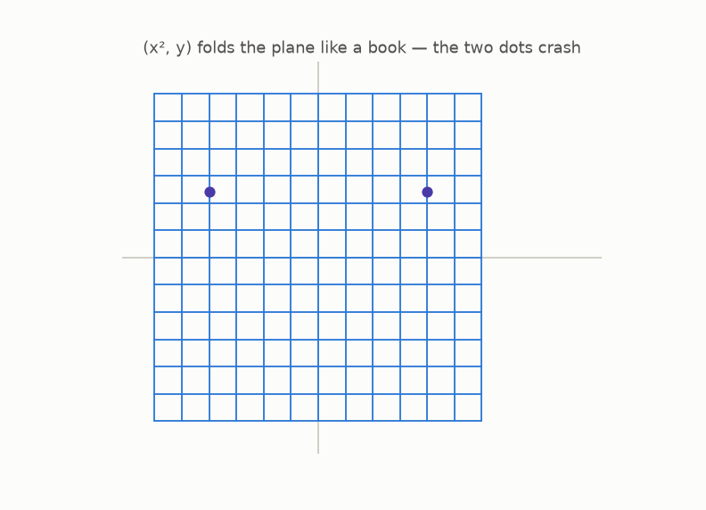
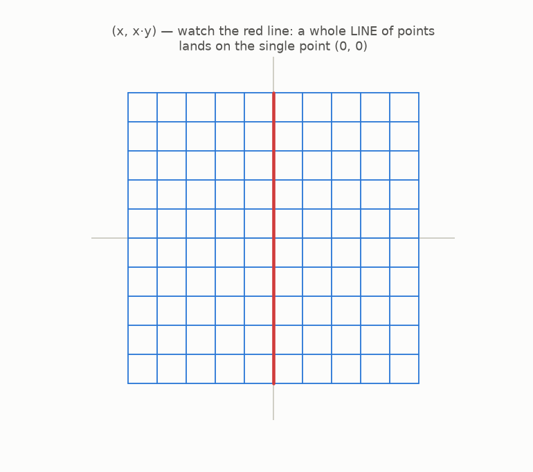

# 6 · Bending the grid

*By the end of this page you will have met the heroes and the villains of this story: polynomial maps that bend the plane without ever crushing it, and ones that fold it flat.*

## A bend that destroys nothing

Meet the guide's favorite map, the **shear**:

```math
F(x, y) = (x + y^2,\; y)
```

Recipe in words: *slide each horizontal row to the right by $y^2$.* Rows near the middle barely move; far rows fly. Watch it bend the plane, and keep your eye on the yellow patch:



The grid bends, but *nothing is squeezed and nothing is stretched*: every little patch of paint keeps **exactly its area** (the picture's patch: area 1 before, area 1 after). And undoing this map is easy, you slid each row right by $y^2$, so… slide it back left:

```math
G(x, y) = (x - y^2,\; y)
```

$G$ undoes $F$ perfectly, and $G$ is itself a polynomial map. Our first nontrivial **polynomial map with a polynomial undo**.

## Stack bends to build monsters

Do a vertical shear, *then* a horizontal one. The result of the two-layer stack is one polynomial map:

```math
H(x, y) = (\,x + (y + x^2)^2,\; y + x^2\,)
```



That is the scramble from the very first page of this guide. It looks hopeless, but you know its secret: it is two easy shears stacked, so you undo it by **peeling the layers in reverse order**, like taking off shoes then socks. Its undo map is again polynomial. (In chapter 10 the computer will find it for us.)

This is a machine for making monsters: stack as many shears and straight maps as you like. The result always looks worse and always stays perfectly undoable.

## The villains: folding and crushing

Now the other kind of polynomial map.



$F(x, y) = (x^2, y)$ **folds** the plane like closing a book: the left half lands exactly on the right half. The two dots are the collision from chapter 2, now in 2D: two different points, one landing spot. Not undoable.



$F(x, y) = (x, x\cdot y)$ **crushes**: the whole vertical center line collapses onto one single point. Not undoable either.

## The pattern worth a fortune

Put the chapter's cast side by side:

- Heroes (shear, stacked shears): **bend but never crush** → undoable, with polynomial undo.
- Villains (fold, crush): somewhere, area gets **squeezed to zero** → collisions → no undo.

It smells like chapter 5's law ("undoable ⟺ area factor ≠ 0") wants to generalize from straight maps to *bent* maps. But a bent map stretches area differently in different places… so what plays the role of "the" area factor? For that we need a microscope.

## Try it

```bash
python src/viz/ch06_polynomial_maps.py
```

---

> **The one thing to remember:** stacked shears bend the plane into monsters that are secretly tame, while folds and crushes kill area somewhere and can never be undone.

[← Straight maps and area](../05-straight-maps-and-area/README.md) · [Next: the microscope →](../07-the-microscope/README.md)
