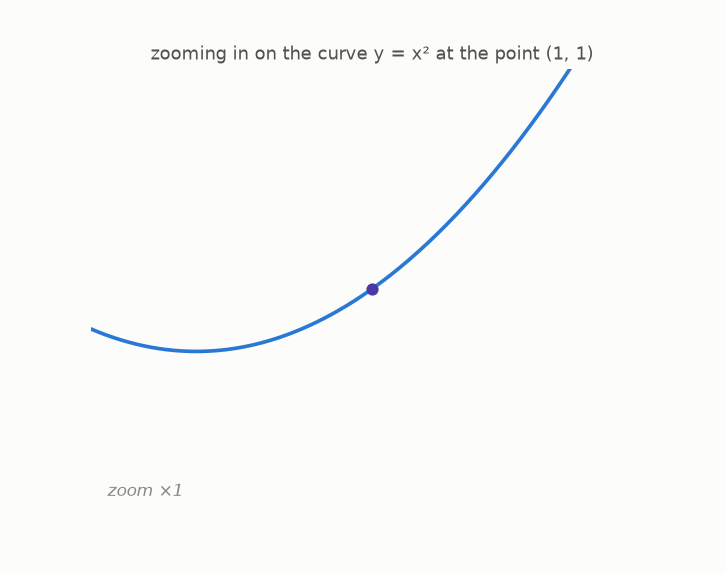
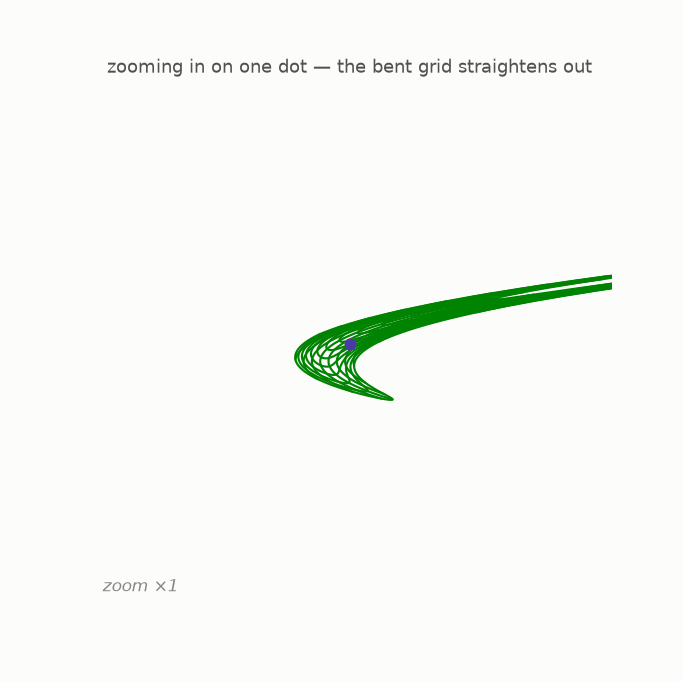
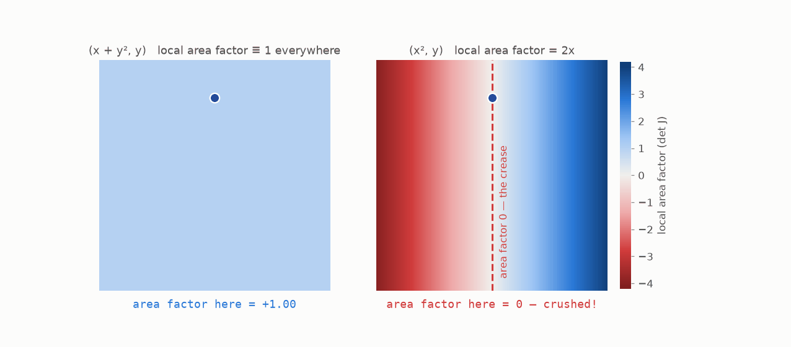

# 7 · The microscope

*By the end of this page you will know what a **Jacobian** is. It sounds like the scariest word in the story; it is actually just a microscope.*

## Zoom in on a curve

Take the curvy graph of $y = x^2$ and zoom in on one point:



Under the microscope the curve *straightens out*. Zoom enough and it is indistinguishable from a straight line. The slope of that line (here: 2) is called the *derivative* at that point — and this simple observation, "smooth things look straight up close," is the whole soul of calculus. That is genuinely all you need to know about calculus today.

## Zoom in on a bent map

Now do the same with our bent grids. Take the monster map $H$ from last chapter, pick the point $p = (0.5,\, 0.5)$, and zoom in on what $H$ does near $p$:



Straight. Parallel. Evenly spaced. Everything chapter 5 asked for! **Up close, a bent polynomial map is indistinguishable from a straight map.**

That local straight map has a name:

> The **Jacobian** of $F$ at the point $p$ is the straight map you see when you zoom in on $F$ near $p$.

Different points show different straight maps under the microscope — the Jacobian *depends on where you look*. (The computer finds it by a mechanical recipe — a little grid of derivatives, one per input–output pair. You will never compute one by hand here; `sympy` does it in chapter 10.)

## The local area factor

Here is the payoff. Straight maps have a determinant — an area factor. So:

> At **every point** $p$, the map has a *local area factor*: $\det J_F(p)$, the determinant of its microscope image at $p$. It says how violently $F$ stretches or squeezes *tiny* patches right at $p$ — and whether it flips them.

Let's paint this number over the whole plane for a hero and a villain:



- The shear $(x + y^2, y)$: local area factor **exactly 1 at every point**. Under every microscope, at every location, it is a perfect area-preserving straight map. That is the precise meaning of "bends but never crushes".
- The fold $(x^2, y)$: local area factor $2x$. Positive on the right (kept orientation, blue), **negative on the left** (that half got mirror-flipped — red), and **zero exactly on the crease** where the book folds. The map's crime scene is literally painted by its local area factor.

## Try it

```bash
python src/viz/ch07_jacobian.py
```

Point the microscope somewhere else: change `P = (0.5, 0.5)` and re-run.

---

> **The one thing to remember:** zoom in anywhere on a smooth map and you see a straight map — the Jacobian at that point. Its determinant is the *local* area factor, and where that factor hits 0 is exactly where the map crushes.

[← Bending the grid](../06-bending-the-grid/README.md) · [Next: local vs global →](../08-local-vs-global/README.md)
