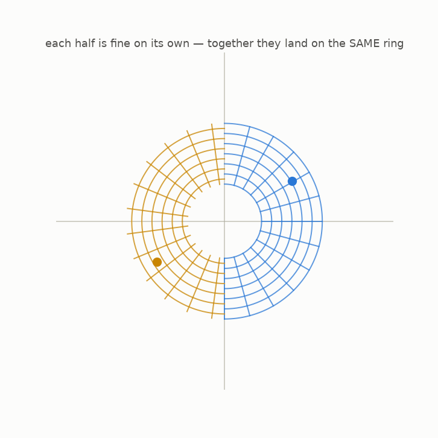
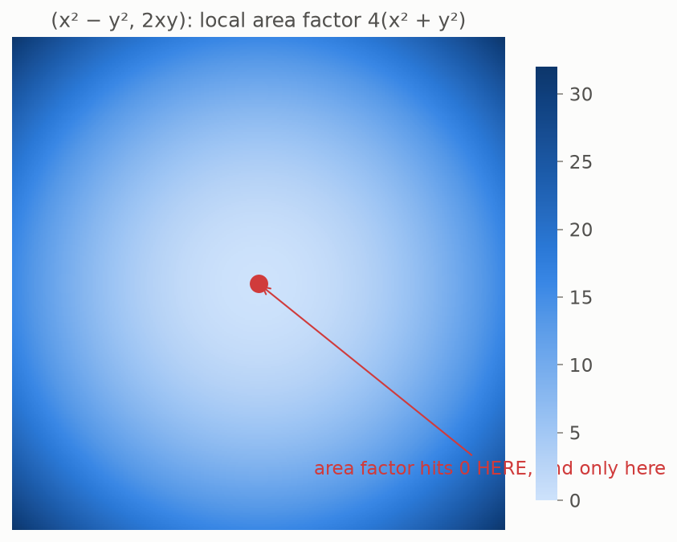

# 8 · Local vs global

*By the end of this page you will see the trap at the heart of this whole subject: a map can be flawless under every microscope and still be broken.*

## A tempting shortcut

Chapter 7 gave us a dream tool. Want to know if a map is undoable? Check the local area factor everywhere. If it is never zero, the map never crushes anything, anywhere — so surely it can be undone…?

It *is* true that a nonzero local factor at $p$ makes the map undoable **near $p$**: zoom in enough and it is a healthy straight map, and healthy straight maps have undo maps. Mathematicians call this the *inverse function theorem*, and it is rock solid.

But watch what it does **not** promise.

## The wrap-around

Take the polynomial map $F(x, y) = (x^2 - y^2,\; 2xy)$ and apply it to a ring around the center. Blue half on the right, gold half on the left:



Each half, on its own, maps beautifully — smooth, no creases, no crushing; near every single point the microscope reports "all clear". But the blue half covers the **entire** target ring… and the gold half covers **the same ring again**. Every point of the target is hit **twice**, by two points far apart from each other (the blue and gold dots crash).

Collisions — but not the local kind. Each collision pairs two points from *opposite sides of the plane*. No microscope, however strong, can see both at once. **Local health everywhere; global failure.**

## How many bad points caused this?

On the whole plane, this map's local area factor is $4(x^2 + y^2)$:



Zero at **one single point** — the center — and healthy everywhere else. One bad point out of infinitely many, and the map exploits it to wrap the plane around twice. That is how delicate this game is.

<details>
<summary>It gets worse (a glimpse beyond polynomials)</summary>

There are smooth (non-polynomial) maps whose local factor is nonzero at *every* point, with no exceptions, that still hit targets infinitely often — the plane gets rolled up like an infinite carpet. So for general smooth maps, "locally fine everywhere" is *hopelessly* far from "globally undoable". Whatever hope remains must come from using very special machines… like polynomials.

</details>

## The right question

So "local factor never zero" is not enough in general. If we want global undoability from a local condition, we need to bet on something extra. Keller's bet: demand the strongest local condition imaginable — the local area factor is not just nonzero but **the same constant everywhere** — and demand the map be **polynomial**. Is *that* enough?

That is the Jacobian Conjecture. Next page assembles it properly.

## Try it

```bash
python src/viz/ch08_local_global.py
```

---

> **The one thing to remember:** the microscope only certifies a map *near each point*. Far-apart points can still collide — local invertibility everywhere does not give global invertibility.

[← The microscope](../07-the-microscope/README.md) · [Next: the conjecture →](../09-the-conjecture/README.md)
