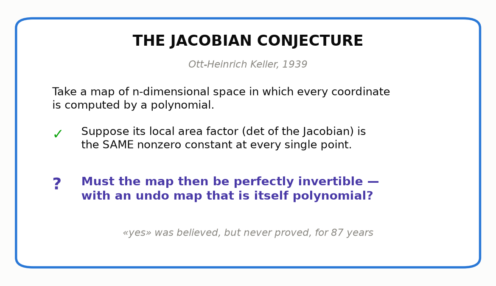

# 9 · The conjecture

*By the end of this page you will understand — fully, honestly, with no missing pieces — a problem that made mathematicians miserable for 87 years.*

## Assemble the pieces

You now own every part:

1. **Undoable** = no collisions, no gaps (chapter 2).
2. **Polynomial maps** = machines built from plus and times only (chapters 3–4).
3. **Determinant** = the area factor of a straight map; zero means crushed (chapter 5).
4. **Jacobian** = the straight map under the microscope; $\det J$ = the *local* area factor at each point (chapter 7).
5. **The trap**: a nonzero local factor everywhere still doesn't force global undoability (chapter 8).

Keller's move, in 1939: play the strongest local card in the deck. Don't just ask the local area factor to avoid zero. Ask it to be **the same nonzero constant at every single point** — like the shear, like the stacked-shear monsters, whose local factor is exactly 1 everywhere. And keep the machines as tame as machines get: polynomial.

Surely — *surely* — such a map must be globally undoable, with a polynomial undo?

That is the **Jacobian Conjecture**. Not a theorem — a conjecture: a belief nobody could prove.

## The fine print (read once, then relax)

- **"n-dimensional"**: the question is asked not just for the plane but for maps of 3-dimensional space, 4-dimensional space, and so on — each coordinate a polynomial in all the input coordinates. Our pictures are 2D because that is what eyes are for.
- **Complex numbers.** Officially the conjecture is asked over the *complex numbers* — a larger number system where every polynomial equation has solutions. 

Why that's the natural home (optional)

  Over the complex numbers, a polynomial that *never* takes the value 0 must be a constant (for one variable this is the famous *fundamental theorem of algebra*). So over ℂ, "the local area factor is never zero anywhere" and "it is a nonzero constant" are **the same demand** — the hypothesis is exactly "no crushing anywhere, period". Over the real numbers they differ: $1 + x^2$ never hits zero yet isn't constant. And we will see in chapter 11 that the real-numbers version of the conjecture is actually **false** — so Keller's complex setting isn't pedantry, it is load-bearing. Our real-plane pictures remain honest shadows of the complex story: a complex map with constant determinant, viewed with real eyes, never crushes and never mirror-flips anywhere.

  

- **Only injectivity is at stake.** By a deep theorem (Ax–Grothendieck), if a complex polynomial map has *no collisions*, it automatically has *no gaps*, and its undo map is automatically polynomial. So the entire 87-year battle was over one question: **can two different points share an output?**

## Why it looks so winnable

Every hero you met satisfies the hypothesis (local factor ≡ 1) and is undoable. Chapter 10 will show you that *every* example anyone ever constructed confirms the conjecture — and that for degree-2 maps it is a proven theorem. It looks like a ripe apple.

It hung there, unpicked, from 1939 to 2026.

---

> **The one thing to remember — the Jacobian Conjecture:** *if a polynomial map's local area factor is the same nonzero constant at every point, must the map be undoable, with a polynomial undo?*

[← Local vs global](../08-local-vs-global/README.md) · [Next: kicking the tires →](../10-kicking-the-tires/README.md)
