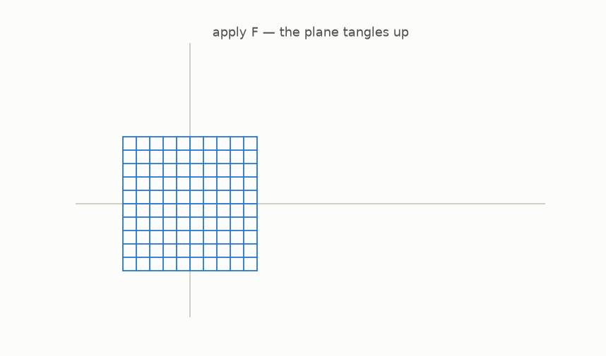

# 10 · Kicking the tires

*By the end of this page you will have tested the conjecture yourself, with a computer doing exact algebra, not approximations.*

## Let the machine do the algebra

Python's `sympy` library computes with polynomials *exactly*, the way you would with a pencil and infinite patience. This repo wraps it in a few helpers. Here is a real session with the monster map $H(x,y) = (x + (y+x^2)^2,\; y + x^2)$:

```python
>>> from jacobian_guide.core import jacobian_det, invert, compose, degree
>>> from jacobian_guide.examples import VARS, TANGLED   # TANGLED is H

>>> jacobian_det(TANGLED, VARS)          # local area factor, symbolically
1
```

Constant 1, at every one of the infinitely many points, certified by algebra. $H$ satisfies Keller's hypothesis. Now the real test, ask for the undo map:

```python
>>> G = invert(TANGLED, VARS)
>>> G
(x - y**2, -x**2 + 2*x*y**2 - y**4 + y)

>>> compose(G, TANGLED, VARS)            # undo after do = ?
(x, y)
```

There it is: an explicit polynomial undo, and the round trip is *exactly* the identity, every point walks home:



And a villain, for contrast: the fold $(x^2, y)$ has `jacobian_det` $= 2x$, **not** constant, so it never claimed to satisfy the hypothesis. The conjecture predicts nothing about it. Consistent.

## The score after decades of testing

```python
>>> degree(TANGLED, VARS), degree(G, VARS)
(4, 4)
```

| map | local area factor | undoable? | degree → undo degree |
|---|---|---|---|
| shear $(x+y^2,\,y)$ | 1 | yes | 2 → 2 |
| monster $H$ | 1 | yes | 4 → 4 |
| triple-stack $H_3$ | 1 | yes | 4 → 4 |
| fold $(x^2,\,y)$ | $2x$, disqualified | no | n/a |

Everything anyone ever built confirmed the pattern. And theory joined in:

- **Degree ≤ 2 is a theorem** (Wang, 1980): every degree-2 Keller map, in any dimension, is undoable.
- **Degree 3 is the whole war** (Bass–Connell–Wright, 1982): if the conjecture holds for degree-3 maps, it holds for all degrees. The entire problem was compressed into degree 3, and *still* would not fall.
- **In the plane, checked up to degree 100** (Moh, 1983, computer-assisted).

A curiosity from the table: in the plane, an undo map always has the *same* degree as the map. In dimension 3 and up, the undo can be enormously more complicated than the map, one more hint that higher dimensions play by wilder rules. Remember that hint.

## Try it

```bash
python -m pytest tests/ -q        # every claim in this guide, re-verified
python src/viz/ch10_roundtrip.py
```

Build your own monster: open `src/jacobian_guide/examples.py`, stack more shears into `TANGLED3`, and let `invert` hunt down its undo.

---

> **The one thing to remember:** every constructed example confirmed the conjecture; degree 2 was proved, and the whole problem was squeezed into degree 3, where it stayed, unbeaten, for four more decades.

[← The conjecture](../09-the-conjecture/README.md) · [Next: why it was so hard →](../11-why-it-was-so-hard/README.md)
