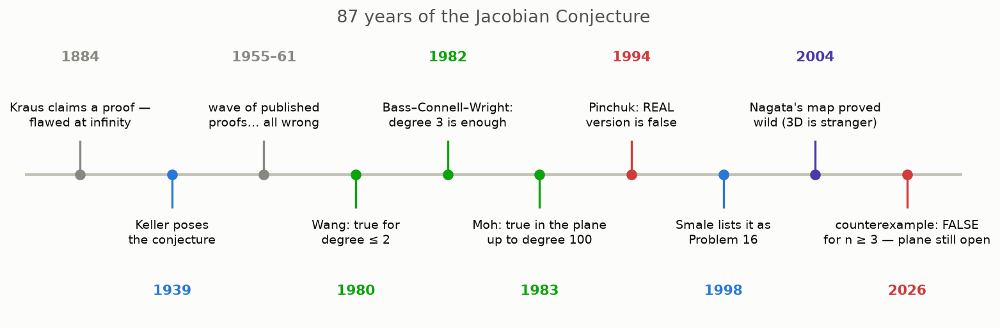
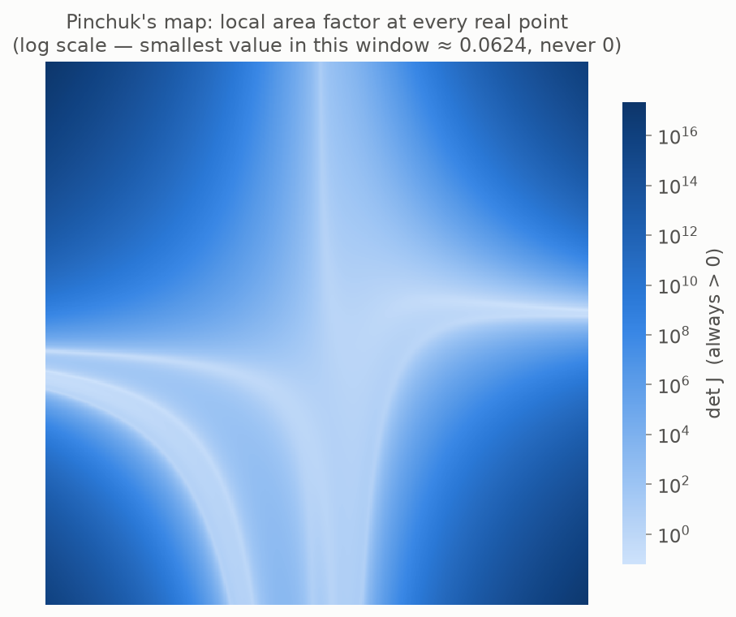

# 11 · Why it was so hard

*By the end of this page you will know the three trapdoors that swallowed 87 years of proof attempts — including published proofs by serious mathematicians.*

## A graveyard of proofs



The pattern repeats for a century: someone announces a proof; the world gets excited; a subtle hole is found. It happened to Kraus in 1884 (before Keller even stated the problem!), to Engel in 1955, three times to Segre, to Gröbner, and to a steady stream of modern attempts. The conjecture earned a reputation as mathematics' most reliable producer of *almost*-proofs.

Why? Because any successful proof must squeeze through three trapdoors at once.

## Trapdoor 1: it is false over the real numbers

Hope: maybe ordinary real-plane geometry — the kind our pictures show — is enough to force undoability once the local factor never vanishes.

**No.** In 1994, Sergey Pinchuk constructed an explicit pair of polynomials $(p, q)$ — degrees 10 and 25 — whose local area factor is **strictly positive at every real point**… and which still sends two different points to the same place.



No crushing anywhere, no mirror-flipping anywhere — and still a collision. Real-variable reasoning alone can *never* prove the conjecture, because the real version of the statement is a lie.

<details>
<summary>How can we be sure the factor is never zero? (a gem, optional)</summary>

Pinchuk's local area factor obeys an exact algebraic identity: with his auxiliary polynomials $t$ and $f$,

```math
\det J = t^2 + \big(t + f\,(13 + 15h)\big)^2 + f^2
```

— a **sum of three squares**, so it can never be negative; and a two-line argument shows $t$ and $f$ can't vanish together, so it is never zero. This repo verifies the identity symbolically: `tests/test_pinchuk.py`. The conjecture survives because Pinchuk's factor, while never zero, is not *constant* — over the complex numbers those would be the same thing (chapter 9), but over the reals they are not. The complex setting is doing real work.

</details>

## Trapdoor 2: it is false in "clock arithmetic"

Hope: maybe pure algebra — just formal manipulation of polynomial symbols, valid in any number system — can do it.

**No.** In arithmetic on a clock with a prime number $p$ of positions (add, multiply, wrap around), the innocent one-variable machine $F(x) = x - x^p$ has constant slope 1 — the perfect Keller hypothesis — yet it maps *every* clock position to 0. Total collapse. So any proof must genuinely use a property that ordinary numbers have and clock arithmetic lacks (*characteristic zero*, in the jargon). Purely formal symbol-pushing cannot be enough.

## Trapdoor 3: the danger hides at infinity

Hope: a classical theorem (Hadamard) says a map that is locally undoable everywhere **and** doesn't let points "escape to infinity" is globally undoable. Maybe polynomial maps can't escape?

**They can.** Take the crush map $(x, xy)$ and the points $(1/2, 2), (1/3, 3), (1/4, 4), \dots$ — they march off to infinity, while their outputs $(1/2, 1), (1/3, 1), (1/4, 1), \dots$ calmly approach an ordinary point. A sequence flees; its shadow stays. So the escape hatch is open, all the interesting action happens "near infinity", and that is exactly where every naive argument — starting with Kraus's in 1884 — silently leaked.

## And one more omen: dimension 3 is stranger

Every plane monster we built was stacked from shears and straight maps, and until 2004 one could hope all constant-factor maps, in all dimensions, were such stacks in disguise — stacks are always undoable, and the conjecture would follow. In the plane this is genuinely true (every polynomial undo-able map unstacks into shears — a classical theorem). But in three dimensions, Nagata's map — local factor 1, polynomial undo, perfectly nice — was proved (Shestakov–Umirbaev, 2004) to be **unstackable**: it cannot be built from shears and straight maps. Three-dimensional space contains genuinely wilder creatures than the plane. Remember *that* hint too.

## Try it

```bash
python src/viz/ch11_history.py
python -m pytest tests/test_pinchuk.py -q
```

---

> **The one thing to remember:** any proof had to use *polynomial-ness*, *complex numbers*, and *control of infinity* simultaneously — real analysis fails (Pinchuk), formal algebra fails (clock arithmetic), and compactness fails (escape to infinity). Almost nothing survives all three trapdoors.

[← Kicking the tires](../10-kicking-the-tires/README.md) · [Next: the fall →](../12-the-fall/README.md)
