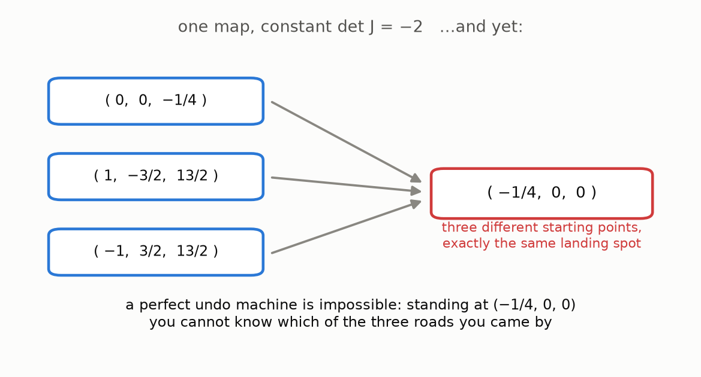

# 12 · The fall

*July 2026. The week this guide was being written, the 87-year-old conjecture collapsed — in every dimension except the one it was born in. This page shows you the actual object that did it. You can check it yourself.*

## The news

On July 19–20, 2026, an explicit counterexample to the Jacobian Conjecture in **three variables** was announced. The construction is attributed to the mathematician Levent Alpöge, answering a version of the question posed by a colleague ("Akhil"), with the decisive example produced with the help of the AI model Claude Fable. At the time of writing there is no peer-reviewed paper yet — so this guide does what mathematics always does with an announcement: **distrust, and verify.** Every claim below is re-checked, independently and exactly, by this very repository (`tests/test_counterexample.py`). Nothing on this page asks for your trust.

## The map

Write $u = 1 + xy$ as a shorthand. The map takes a 3D point $(x, y, z)$ to the 3D point $(P, Q, R)$:

```math
\begin{aligned}
P &= u^3\,z + y^2\,u\,(4 + 3xy) \\
Q &= y + 3x\,u^2\,z + 3xy^2\,(4 + 3xy) \\
R &= 2x - 3x^2 y - x^3 z
\end{aligned}
```

Three polynomials. Degrees 7, 6 and 4. Coefficients a child could copy down.

**Fact 1 (the hypothesis holds).** Its local volume factor — the 3D Jacobian determinant — is exactly the constant $-2$. Everywhere. The strongest local condition in the deck, precisely Keller's hypothesis. (The sign just says space comes out mirror-flipped, uniformly; the size never wavers.)

**Fact 2 (and yet):**



Three different points. One landing spot. Standing at $(-1/4,\, 0,\, 0)$, you cannot know which road you came by — the collision from chapter 2, and with it, the death of any undo machine. **The Jacobian Conjecture is false in three dimensions.**

And it topples in every higher dimension too: in 4D, map the extra coordinate to itself, $(x,y,z,w) \mapsto (P, Q, R, w)$ — the volume factor is still $-2$, the collision still collides. Same for 5D, 6D, forever.

## Check it yourself — by hand

The third coordinate is friendly: $R = 2x - 3x^2y - x^3z$. Take the three points and *actually plug in*:

- $(0,\ 0,\ -\tfrac14)$: $\quad R = 0 - 0 - 0 = 0$ ✓
- $(1,\ -\tfrac32,\ \tfrac{13}{2})$: $\quad R = 2 - 3\cdot(-\tfrac32) - \tfrac{13}{2} = 2 + \tfrac92 - \tfrac{13}{2} = 0$ ✓
- $(-1,\ \tfrac32,\ \tfrac{13}{2})$: $\quad R = -2 - \tfrac92 + \tfrac{13}{2} = 0$ ✓ &nbsp; *(here $-3x^2y = -\tfrac92$, and $-x^3z = +\tfrac{13}{2}$ because $x^3 = -1$)*

Now the first point in full: at $(0, 0, -\tfrac14)$ we get $u = 1$, so $P = 1 \cdot (-\tfrac14) + 0 = -\tfrac14$ and $Q = 0 + 0 + 0 = 0$. The point maps to $(-\tfrac14, 0, 0)$, by arithmetic you just did in your head. An 87-year-old fortress, and the door is open.

## Check it yourself — by computer

The two remaining points involve fractions like $\tfrac{13}{2}$ raised to powers — pencil-able, but let exact algebra earn its keep:

```python
from sympy import symbols, Matrix, Rational, simplify

x, y, z = symbols("x y z")
u = 1 + x*y
P = u**3*z + y**2*u*(4 + 3*x*y)
Q = y + 3*x*u**2*z + 3*x*y**2*(4 + 3*x*y)
R = 2*x - 3*x**2*y - x**3*z

print(Matrix([P, Q, R]).jacobian([x, y, z]).det().expand())   # -> -2

for pt in [(0, 0, Rational(-1, 4)),
           (1, Rational(-3, 2), Rational(13, 2)),
           (-1, Rational(3, 2), Rational(13, 2))]:
    print([f.subs(dict(zip((x, y, z), pt))) for f in (P, Q, R)])
# -> [-1/4, 0, 0]  three times
```

Or simply run this repo's test suite: `python -m pytest tests/test_counterexample.py -q`.

## What survives

Keller asked his question in 1939 **for the plane**. The counterexample lives in dimension 3 and needs the room (remember the omens: wild unstackable maps exist only in 3D+, undo-degrees only explode in 3D+). The plane case — two variables, the original question, checked up to degree 100 — **remains open to this day.** The oldest piece of the puzzle is still on the table.

## Why this ending is beautiful

For 87 years the question was: *which extra hypothesis forces global undoability?* Everyone believed "polynomial + constant factor" was enough, and the graveyard filled with proofs of it. The answer turned out to be: **it is not enough** — the escape-to-infinity trapdoor of chapter 11 is real, exploitable, and exploitable by polynomials of degree seven. The conjecture didn't need a cleverer proof. It needed a disproof — and the disproof is so concrete that a person with no mathematical training can hold it in one hand and check it with the other.

That is what you just did.

## Where to go next

- **This repo's notes**: [notes/research-content.md](../../notes/research-content.md) — sources, verification details, the fuller map of known results.
- A. van den Essen, *Polynomial Automorphisms and the Jacobian Conjecture* — the standard book (advanced).
- T. Tao's blog post on the Ax–Grothendieck theorem — the "no collisions ⇒ no gaps" magic, via counting.
- L. A. Campbell, *Picturing Pinchuk's Plane Polynomial Pair* (arXiv:math/9812032) — the real-case counterexample, in pictures.
- The Wikipedia article *Jacobian conjecture* — updated status and references.

## Try it

```bash
python src/viz/ch12_fall.py
python -m pytest tests/ -q      # re-verify EVERYTHING this guide claimed
```

---

> **The one thing to remember:** an explicit degree-7 map of 3D space has constant volume factor −2, yet three roads meet at one point — the Jacobian Conjecture is **false in dimension 3 and above**, and **still open in the plane**, where it all began.

[← Why it was so hard](../11-why-it-was-so-hard/README.md) · [Back to the start](../00-start-here/README.md)
